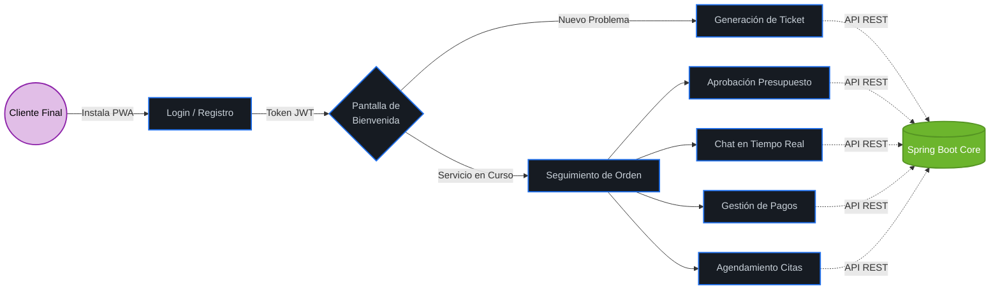

# 📱 ReparaSuite - Portal Cliente (PWA)

Este repositorio contiene el Frontend de Clientes de **ReparaSuite**, una **Progressive Web App (PWA)** diseñada para ser la capa de autoservicio del ecosistema. Construida con **Angular 19**, su objetivo principal es reducir la fricción, aportar transparencia y unificar la comunicación entre el taller y el usuario final.

## 🗺️ Customer Journey (Flujo de Autoservicio)

A diferencia del Backoffice (que maneja alta densidad de datos), el Portal Cliente tiene un enfoque 100% experiencial. El usuario inicia el contacto, crea un Ticket con validaciones estructuradas y, una vez aprobado, interactúa directamente con su Orden de Trabajo (OT).

🚦 Trazabilidad de la Orden de Trabajo
El núcleo de la experiencia del cliente es la visibilidad total sobre el progreso de su servicio. La interfaz gráfica se actualiza dinámicamente según el estado interno de la OT:

Fragmento de código

🚀 Características Principales (Features)
PWA Installable: Capacidad de instalarse directamente en el smartphone del cliente (App Shell) sin pasar por App Store/Play Store, gracias a la configuración de Service Workers y Manifest.

Diseño Mobile-First: Interfaces limpias y responsivas, optimizadas para uso táctil y lectura rápida.

Autoservicio Integral: Generación de tickets con carga de evidencia fotográfica estructurada.

Transparencia en Tiempo Real: Timeline visual del estado de la Orden de Trabajo (RECIBIDA ➔ PRESUPUESTO ➔ EN_CURSO...).

Centro de Resoluciones: Aceptación/Rechazo de presupuestos y carga de comprobantes de pago centralizados en la vista de la OT.

Comunicación Directa: Canal de mensajería asíncrona integrado con el Backoffice para evitar la dispersión en WhatsApp o correos.

🛠️ Stack Tecnológico
Framework: Angular 19 (Standalone Components).

Arquitectura Web: Progressive Web App (Service Workers @angular/pwa).

Lenguaje: TypeScript.

Librería de UI: Angular Material (estilos adaptados a B2C - Business to Consumer).

Gestión de Estado: RxJS Observables.

⚙️ Configuración del Entorno
Requisitos previos
Node.js (v18 o superior)

Angular CLI 19

Instalación rápida
Clonar: git clone https://github.com/GledysP/reparasuite-portal.git

Instalar dependencias: npm install

Configurar Entorno: Ajustar la URL de la API en src/environments/environment.ts.

Ejecutar: ng serve
